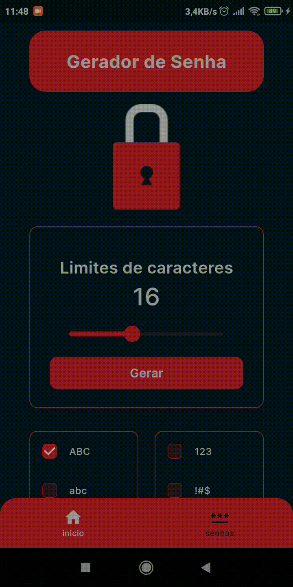

# GERADOR DE SENHAS

O Aplicativo foi desenvolvido com intuito de aprimorar meu aprendizado em desenvolvimento de aplicativos móveis feito em flutter.

Para desenvolver este aplicativo utilizei três  Gerenciadores de estados,e eles são:

- Provider
- ChangeNotifier
- ValueNotifier

E para armazenamento local utilizei o <b>SharedPreferences.</b>

## Padrão de design (design pattern)

Este Aplicativo foi feito usando um padrão de design <b> MVVM (Model View ViewModel).</b>

## Tipos de opções para a geração de senha

No aplicativo de gerar senha existe quatro opções para gerar senhas, e elas são:

<ul>
    <li><b>Maiúsculas (ABC)</b></li>
    <li><b>Minúsculas (abc)</b></li>
    <li><b>Numeros (123)</b></li>
    <li><b>Símbolos (#$%)</b></li>
</ul>

Por padrão a opção <b>Maiúsculas</b> é selecionada, se nenhuma dessas opções estiver selecionada, não vai ser possivel gerar a senha.</
p>

## Limites de caracteres

O valor inicial para gerar a senha é <b>16</b>, mas, Não é possivel alterar o valor inicial.

| LIMITES |  QUANTIDADES |
| ------- | ------------ |
| Máx     |  32          | 
| Mix     |  5           |

Os limites máximo e minimo tambem não é possivel fazer alterações dos seus valores.

## Estilos de textos e de cores

O Estilo da fonte usada no aplicativo é a <b>Inter</b> esta fonte foi obtida pelo pacote <a href="https://pub.dev/packages/google_fonts">google_fonts</a>.

|   Nome das cores            |                Hexdercimal             |
| ------------------------------------------------------ | ----------- |
| <b>Rich black</b> | #011C27   |
| <b>White</b>      | #E1E1E2   |
| <b>Red</b>        | #DB222A   |
| <b>Green</b>      | #00CC66   |
| <b>Orange</b>     | #FFA400   |
| <b>Gray</b>       | #7C7C7C   |

 

